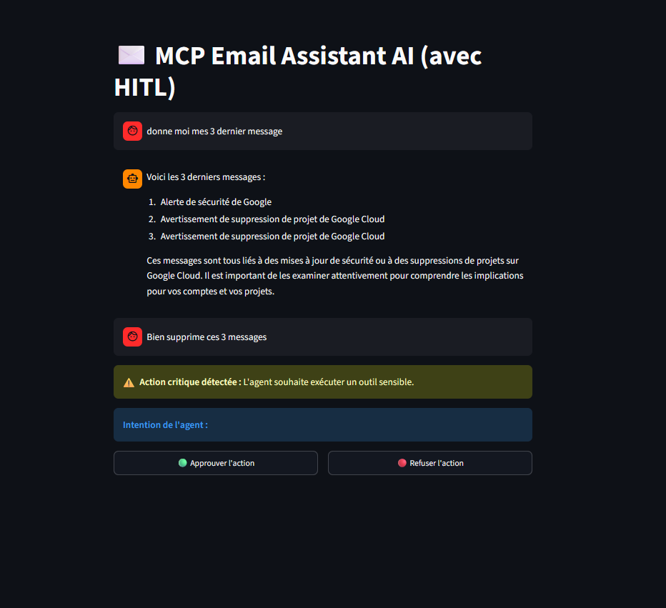

# ✉️ MCP Email Assistant AI (avec HITL)

Assistant de messagerie intelligent et hautement sécurisé fondé sur l'architecture LangGraph et le Model Context Protocol (MCP) de Anthropic. L'application intègre une gouvernance stricte des actions critiques via un mécanisme de validation humaine (Human-In-The-Loop) et une optimisation dynamique du contexte par résumé automatique.

## Fonctionnalités Clés

* Architecture MCP (Model Context Protocol) : Découplage propre du serveur d'outils Gmail (mcp_gmail.py) et du cœur d'exécution de l'agent.

* Sécurisation HITL (Human-In-The-Loop) : Interception systématique et rigoureuse de toute action sensible (envoi, suppression) avant exécution. Gestion dynamique des appels d'outils en parallèle.

* Summarization Middleware : Compression intelligente et transparente de l'historique des conversations en arrière-plan pour optimiser l'utilisation de la fenêtre de contexte (Context Window) et réduire les coûts de tokens.

* Interface Streamlit "Wide Layout" : Expérience utilisateur fluide et immersive maximisant l'espace disponible pour une lisibilité accrue des courriels.

* Suite de Tests Asynchrones : Validation unitaire automatisée du cycle de vie du graphe, des interruptions et des reprises d'état via pytest-asyncio.
## 📸 Aperçu de l'interface

L'interface simple et conviviale quie dès qu'une action de suppression ou d'envoi est demandée, l'agent fige son état. La zone de saisie est verrouillée et cède sa place à un panneau de contrôle orange permettant à l'opérateur d'approuver ou de rejeter l'action.



## Structure du Projet
```text 
├── server/
|   ├── google_api.py         # Gere autentification aux différents services 
│   ├── mcp_gmail.py          # Serveur MCP exposant les API Gmail
│   └── secret.json           # Le fichier donnée par google cloud utile pour creer authentification
├── tools/
│   └── agent_tools/
│   │    └── mcp_tools.py      # Client MCP et adaptateur d'outils LangChain
|   └── google/
|        └── gmail_tools.py    # les operation CRUD pour Gmail
|   
├── tests/
│   └── test_agent.py         # Tests unitaires asynchrones (Pytest)
|
├──  agent_core.py            # Cœur du graphe, LLM et chaînage des middlewares
├── app.py                    # Interface graphique Streamlit (Wide mode)
├── requirements.txt          # Dépendances du projet
└── .env                      # Variables d'environnement (clés API)
```

## Installation et Configuration

### 1. Prérequis & Environnement
Clonez le dépôt et configurez votre environnement virtuel Python :

```bash
python -m venv langgraph-venv
source langgraph-venv/bin/activate  # Sur Windows: .\langgraph-venv\Scripts\activate
pip install -r requirements.txt
```

### 2. Variables d'environnement
Créez un fichier .env à la racine du projet :
```bash
GROQ_API_KEY=your_groq_api_key
OPENAI_API_KEY=your_openai_api_key
```

### 3. Authentification & Configuration Google Cloud (Obligatoire)
Pour permettre à l'agent d'interagir de manière sécurisée avec votre boîte Gmail, vous devez configurer vos accès développeur Google :

* Créer un Projet : Rendez-vous sur la Google Cloud Console et créez un nouveau projet.
* Activer l'API : Dans le catalogue des API, recherchez Gmail API et cliquez sur Activer.
* Écran de consentement OAuth : Configurez votre écran de consentement (choisissez le type External et ajoutez votre adresse e-mail comme utilisateur de test).
* Créer les Identifiants : * Allez dans l'onglet Identifiants (Credentials) -> Créer des identifiants -> ID de client OAuth puis Sélectionnez le type d'application (Desktop App).
* Télécharger et Placer le Secret : * Téléchargez le fichier JSON généré par Google.
    * Renommez-le impérativement en secret.json.
    * Placez-le directement dans le dossier server/ de votre projet (projects/email-assistant/server/secret.json).

> 💡 Note au premier lancement : Lors de la toute première exécution de l'application, une fenêtre de votre navigateur s'ouvrira automatiquement pour vous demander de vous connecter à votre compte Gmail et d'autoriser l'application. Une fois validé, un fichier de jeton permanent sera généré dans le sous-dossier server/tokenn files/ pour les prochaines connexions transparentes.

## Utilisation
Lancer l'application Web (Streamlit)
Pour démarrer l'interface utilisateur et charger automatiquement le serveur d'outils MCP en arrière-plan :
```bash
streamlit run app.py
```
## Exécuter la Suite de Tests
Les tests simulent de bout en bout l'interception HITL, la reprise sur décision positive (approve) et l'avortement sur décision négative (reject) sans nécessiter d'intervention manuelle dans la console :
```bash
pytest -v
```

## Focus Technique : Gestion des États Évolués
L'intégration conjointe de plusieurs middlewares démontre la robustesse de la gestion de mémoire de cette architecture :

* SummarizationMiddleware : Déclenché dès le dépassement du seuil critique de messages. Il condense l'historique ancien via un modèle rapide (llama3-8b) tout en conservant les derniers échanges textuels intacts.

* HumanInTheLoopMiddleware : Fige l'état du graphe dans un InMemorySaver dès qu'un outil Gmail sensible est ciblé. Le graphe attend alors une instruction explicite Command(resume=...) contenant le nombre exact de décisions aligné sur le nombre de tool_calls générés par le LLM principal (llama3-70b).