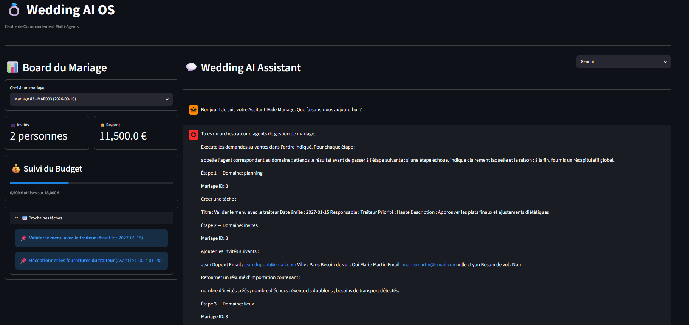

# 💍 Wedding Planner Multi-Agents


## Objectif

Construire un système multi-agents spécialisé dans l'organisation de mariage.

Chaque agent possède :

* un domaine d'expertise clairement défini ;
* un ensemble d'outils autorisés ;
* des frontières strictes pour éviter les chevauchements de responsabilités.

## 🏗️ Architecture du Système
Le projet repose sur un paradigme de supervision hiérarchique où l'utilisateur ne dialogue qu'avec un coordinateur unique.
```text
                     [ Utilisateur / Mariés ]
                               │
                               ▼
                    ┌─────────────────────┐
                    │  STREAMLIT UI (Chat)│
                    └──────────┬──────────┘
                               │
                               ▼
                    ┌─────────────────────┐
                    │     SUPERVISEUR     │
                    │  (Orchestrateur LLM)│
                    └──────────┬──────────┘
                               │
         ┌─────────────────────┼─────────────────────┐
         ▼                     ▼                     ▼
  [ Agent Budget ]     [ Agent Planning ]     [ Agent Invités ]
         │                     │                     │
         ▼                     ▼                     ▼
  (MCP Server BDD)      (MCP Server BDD)      (MCP Server BDD)
         │                     │                     │
         └─────────────────────┼─────────────────────┘
                               ▼
                     [ Base de Données SQLite ]
```

## 👥 Les Agents Spécialisés
* Superviseur Central (supervisor.py) : Cerveau du système. Il segmente les requêtes des mariés, orchestre les appels de sous-agents en séquence et synthétise les résultats.

* Agent Budget (agent_budget.py) : Auditeur financier. Assure le suivi du reste à vivre, injecte les dépenses et gère les flux de modification soumis à validation humaine (En_Attente_Validation).

* Agent Planning (agent_planning.py) : Coordinateur temporel. Gère l'échéancier, génère les jalons critiques (To-Do list) et met à jour l'avancement.

* Agent Invités (agent_invites.py) : Gestionnaire logistique. S'occupe des imports de listes sans doublons, du suivi RSVP et de la cartographie des besoins aériens.

* Agent Vols : Connecté au serveur distant open-source de Kiwi.com via un transport SSE pour indexer et budgétiser les billets d'avion requis.

## 🛠️ Stack Technique

* Framework LLM : LangChain (Core, Agents)
* Moteur d'Inférence : Groq Cloud API (llama-3.1-8b-instant)
* Protocole d'Outils : Model Context Protocol (FastMCP Python Server)
* Base de Données : SQLite3 avec couche d'abstraction transactionnelle propriétaire (server.py)
* Interface Graphique : Streamlit (Layout Wide, réactivité asynchrone)

## 🚀 Installation et Configuration
### Cloner le projet et installer les dépendances

```bash
git clone https://github.com/votre-compte/wedding-ai-os.git
cd wedding-ai-os
pip install -r requirements.txt
```

### Variables d'environnement
Créez un fichier de clés d'environnement (référencé de manière immuable dans le projet) contenant vos accès API.

```bash
GROQ_API_KEY=gsk_your_ultra_secret_groq_api_key_here
GOOGLE_API_KEY=gsk_your_ultra_secret_google_api_key_here
```

### Initialisation de la Base de Données (Impératif)
Avant de lancer l'application pour la première fois, vous devez générer la base de données SQLite locale et créer sa structure (tables mariages, `invites, budget_depenses, taches_planning`) en exécutant le script `structure.sql`
```python
# Sous Windows (PowerShell / CMD)
sqlite3 wedding_planner.db ".read structure.sql"

# Sous Linux / Mac
sqlite3 wedding_planner.db < structure.sql
```
** Note : Assurez-vous que votre fichier server.py pointe bien sur le fichier wedding.db ainsi généré.**

### Protocole MCP (Exemple de configuration client)
Pour que l'Agent Vols se connecte au serveur Kiwi, assurez-vous que votre configuration MCP inclut :
```json
"travel_server": {
    "url": "https://mcp.kiwi.com",
    "transport": "streamable_http"
}
```

### 🖥️ Utilisation
L'application Streamlit centralise l'exécution. Elle appelle en arrière-plan les routines asynchrones de vos agents tout en maintenant une connexion synchrone avec votre base SQLite.
Pour lancer le centre de commandement:
```bash
streamlit run app.py
```
### 💡 Exemples de requêtes complexes à tester dans le Chat :
> "On vient d'ajouter l'invité Jean Dupont (jean@dupont.com) depuis Marseille, il lui faut un vol. Regarde si ça impacte notre budget max et ajoute une tâche au planning pour réserver ses billets avant le mois prochain."

## 🖥️ Interface



## 🔒 Robustesse et Standardisation des Données
Tous les serveurs FastMCP développés pour ce projet respectent un modèle de réponse unifié et strict pour faciliter l'ingestion par le LLM et éviter les hallucinations de parsing :
```bash
{
  "success": true,
  "data": {
    "champ_a": "valeur",
    "champ_b": 0.0
  },
  "error": null
}
```
Si success est évalué à false, l'erreur est interceptée proprement par la chaîne de callbacks LangChain et transmise au Superviseur sans interrompre le cycle de vie de l'application.

## ✍️ Informations Projet

- **Auteur** : Goudjou Borel / Bore237  
- **Date de réalisation** : Juin 2026  
- **Version** : 1.0.0 (MVP Streamlit fonctionnel)